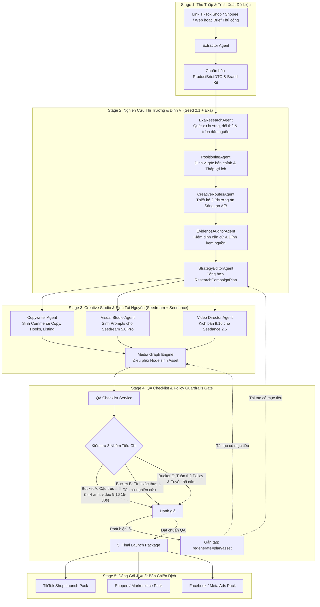

# 🚀 BP-01 — Commerce Campaign Launch Copilot — Thợ Cốt

> **Đội thi:** **Thợ Cốt**  
> **One-liner:** Product brief + market signal in → launch-ready e-commerce campaign pack out, including ad concepts, product visuals, marketplace assets, copy, and A/B testing plan.

[](#-repository--đội-ngũ-thợ-cốt)
[](https://fastapi.tiangolo.com/)
[](https://nextjs.org/)
[](https://byteplus.com)
[](https://www.typescriptlang.org/)
[](LICENSE)

---

## 📌 1. Bối Cảnh & Bài Toán (The Problem & Mission)

### Bài toán thực tế
Các nhà bán hàng E-commerce và đội ngũ thương hiệu hiện nay không chỉ cần *nhiều nội dung hơn* mà cần **tốc độ ra mắt chiến dịch nhanh hơn** — kết nối chặt chẽ giữa định vị sản phẩm, hình ảnh sàn, quảng cáo video ngắn, tệp khách hàng mục tiêu và bài học tối ưu hiệu suất.

Một đợt ra mắt sản phẩm thông thường đòi hỏi nhiều luồng công việc rời rạc: nghiên cứu insight, chiến lược ads, chụp ảnh sản phẩm, thiết kế thumbnail sàn, kịch bản video ngắn, banner, viết copy, lồng tiếng và đo lường. Sự phân mảnh này làm chậm tiến độ ra mắt và gây thiếu nhất quán giữa các kênh (TikTok Shop, Shopee, Facebook Ads). Thách thức lớn nhất không chỉ là *"tạo ra video"* mà là **"nói điều gì, nói với ai, tạo tài nguyên nào và kiểm thử A/B ra sao?"**

### Sứ mệnh của dự án
Xây dựng một **AI Commerce Campaign Launch Copilot** đóng vai trò như một **AI Campaign Operator** toàn năng: tiếp nhận thông tin sản phẩm và tín hiệu thị trường để tự động hoạch định góc tiếp cận, sản xuất trọn bộ tài nguyên quảng cáo/sàn thương mại, sinh video ngắn và lập kế hoạch thử nghiệm A/B phục vụ tăng trưởng doanh số.

---

## 🤖 2. Ứng Dụng Mô Hình AI (Model Usage Matrix)

Dự án tích hợp chuyên sâu hệ thống mô hình nền tảng tiên tiến theo đúng tiêu chuẩn đề bài:

| Mô hình AI | Vai trò & Ứng dụng trong hệ thống | Trạng thái |
| :--- | :--- | :--- |
| **Seedance 2.5 / 2.0 / Mini** | Sinh video ngắn quảng cáo thương mại 9:16 (15–30s), kịch bản phân cảnh (storyboard) và visual motion prototype. | **Bắt buộc (Required)** |
| **Seedream 5.0 Pro** | Sinh bộ ảnh sản phẩm chuẩn E-commerce: Ảnh Hero, Chi tiết SKU, Ảnh Collection/Bối cảnh và Thumbnail/Cover sàn. | **Bắt buộc (Required)** |
| **Seed 2.1** | Lập luận chiến lược, nghiên cứu thị trường, định vị góc bán hàng, viết toàn bộ Commerce Copy và phân tích hiệu suất A/B. | *Mở rộng (Strategy & Reasoning)* |
| **Audio 1.0 (BytePlus)** | Tự động lồng tiếng (voiceover), xử lý âm thanh bản địa hóa và tạo nhịp điệu cho video ngắn. | *Mở rộng (Voice & Localization)* |
| **Exa MCP Search** | Trích xuất tín hiệu thị trường thực tế (Real-time Market Signals), đối thủ cạnh tranh và dữ liệu xu hướng. | *Mở rộng (Live Discovery)* |

---

## 🧠 3. Kiến Trúc Luồng Đa Tác Tử (Multi-Agent Architecture & AI Flow)

Hệ thống điều phối liên hoàn 5 giai đoạn thông qua mạng lưới tác tử AI chuyên trách và cơ chế kiểm soát chất lượng (QA Guardrails):



---

## 📦 4. Đầu Ra Chuẩn Hóa Của Chiến Dịch (Expected Outputs)

Trọn bộ ấn phẩm chiến dịch sẵn sàng triển khai (Launch-Ready Campaign Pack) bao gồm 7 hạng mục hoàn chỉnh:

### 1. Định vị sản phẩm (Product Positioning)
- **Góc tiếp cận chủ đạo (Main Campaign Angle):** Ý tưởng lớn xuyên suốt toàn bộ chiến dịch.
- **Tệp khách hàng mục tiêu (Target Audience):** Chân dung nhân khẩu học, hành vi và nỗi đau (pain points).
- **Thông điệp bán hàng cốt lõi (Key Selling Message):** Khắc sâu giá trị độc bản của sản phẩm.
- **Thứ bậc lợi ích (Product Benefit Hierarchy):** Sắp xếp từ lợi ích vượt trội đến các lợi ích bổ trợ kèm dẫn chứng xác thực `[1]`, `[2]`.

### 2. Hai phương án sáng tạo A/B (Creative Routes)
- **Phương án 1 (Route A):** Góc tiếp cận theo công năng/trải nghiệm thực tế (Product-first / Routine-led).
- **Phương án 2 (Route B):** Góc tiếp cận theo cảm xúc/bằng chứng khoa học/chuyển đổi xã hội (Emotional / Science / Social-proof).
- *Mỗi phương án bao gồm:* Câu mở đầu thu hút (Hook Idea), Định hướng hình ảnh (Visual Direction), Góc thông điệp (Message Angle) và Kênh đề xuất.

### 3. Video ngắn thương mại (Short-form Video Asset)
- **Định dạng chuẩn:** Video dọc 9:16 (15–30 giây) tối ưu cho TikTok Shop / Reels / Shorts, sinh bởi **Seedance 2.5 / 2.0**.
- **Kịch bản phân cảnh:** Chi tiết theo từng giây (0-3s Hook, 3-15s Body/Demo, 15-25s Offer, 25-30s CTA) kèm lời thoại voiceover (Audio 1.0).

### 4. Bộ 4 hình ảnh sàn chuẩn E-commerce (Product Collection Image Set)
Sinh tự động bởi **Seedream 5.0 Pro** với độ phân giải cao:
1. **Product Hero Image:** Ảnh đại diện ấn tượng, nổi bật sản phẩm trên nền studio cao cấp.
2. **SKU / Detail Image:** Ảnh cận cảnh góc cạnh, thành phần hoặc thông số kỹ thuật.
3. **Campaign Collection Visual:** Ảnh phối cảnh bối cảnh sử dụng thực tế (Lifestyle / In-use).
4. **Marketplace Thumbnail / Cover:** Ảnh bìa tối ưu tỷ lệ nhấp chuột (CTR) cho Shopee/TikTok Shop.

### 5. Bộ văn bản bán hàng (Commerce Copy)
- Tiêu đề sản phẩm chuẩn SEO (Product Title).
- Mô tả chi tiết & Bullet points tính năng nổi bật.
- Bài viết quảng cáo (Ad Captions) theo công thức AIDA / PAS.
- Danh sách câu Hook ngắn giật tít và nội dung ưu đãi (Promotion Copy).

### 6. Kế hoạch thử nghiệm A/B (A/B Testing Plan)
- Giả thuyết thử nghiệm rõ ràng (Route A vs Route B).
- Chỉ số đánh giá thành công: CTR (Tỷ lệ nhấp), CVR (Tỷ lệ chuyển đổi), ROAS, Watch time, Add-to-cart rate.
- Bài học dự kiến rút ra từ đợt kiểm thử.

### 7. Phân tích tối ưu hiệu suất (Performance Learning)
- Đưa ra khuyến nghị dựa trên dữ liệu quá khứ hoặc tín hiệu thị trường: **Nên Giữ (Keep)**, **Nên Đổi (Change)**, **Nên Dừng (Stop)** và **Nên Test Tiếp (Test Next)**.

---

## ⚡ 5. Hai Chế Độ Vận Hành Linh Hoạt

1. **🚀 Luồng Tự Động (Autopilot Workflow):** 
   - Dành cho người dùng cần tốc độ: Nhập link sản phẩm $\rightarrow$ Hệ thống 1-Click tự động nghiên cứu, sinh toàn bộ copy, hình ảnh, video và kiểm định QA $\rightarrow$ Xuất Campaign Pack sẵn sàng chạy ads.
2. **🛠️ Làm Từng Bước (Manual Stepper Pipeline):**
   - Dành cho Marketer/Creator chuyên sâu: Đi qua 5 bước (`Input` $\rightarrow$ `Research` $\rightarrow$ `Content Generation` $\rightarrow$ `QA Gate` $\rightarrow$ `Final Output`), cho phép xem cơ sở nghiên cứu trích dẫn, chỉnh sửa prompt và phê duyệt từng tài nguyên.

---

## 📁 6. Cấu Trúc Thư Mục Dự Án (Clean Architecture)

```
Tho_Cot/
├── backend/                         # Backend FastAPI (Python 3.12, Layered Architecture)
│   ├── app/
│   │   ├── api/v1/endpoints/        # REST API Controllers (campaigns, research, studio, qa, extractor)
│   │   ├── core/                    # Cấu hình Pydantic BaseSettings, Exceptions, Security
│   │   ├── crud/                    # Repository Pattern & SQLAlchemy DB queries
│   │   ├── db/                      # Database Session, Base Class & Migrations
│   │   ├── models/                  # SQLAlchemy ORM Models
│   │   ├── schemas/                 # Pydantic v2 DTOs (Request/Response schemas)
│   │   ├── services/                # Business Logic & AI Multi-Agent Handlers
│   │   │   ├── campaign/            # Điều phối vòng đời & trạng thái chiến dịch
│   │   │   ├── extractor/           # Web scraper / Link extractor (TikTok/Shopee/Web)
│   │   │   ├── qa_agent/            # Tác tử kiểm định chất lượng & chính sách quảng cáo
│   │   │   ├── research/            # Tác tử nghiên cứu thị trường, Exa MCP & Định vị
│   │   │   └── studio/              # Tác tử đồ họa (Seedream) & Kịch bản video (Seedance)
│   │   └── main.py                  # Entry point FastAPI, CORS & Middleware
│   ├── tests/                       # Test Suite Pytest
│   ├── requirements.txt             # Danh mục thư viện phụ thuộc Python
│   └── run.sh                       # Script khởi chạy backend 1 chạm
│
├── frontend/                        # Frontend Next.js 16 (App Router + Turbopack)
│   ├── src/
│   │   ├── app/                     # App Router pages (/campaigns, /studio, /research, /analytics)
│   │   │   ├── globals.css          # Design Tokens & Hệ màu chống chói (Muted Slate Sand)
│   │   │   └── layout.tsx           # Root Layout & Theme Provider
│   │   ├── components/              # Giao diện người dùng
│   │   │   ├── flow/                # Modal thêm sản phẩm & khởi tạo luồng Autopilot
│   │   │   ├── pipeline/            # Các màn hình trong quy trình 5 bước (Stage 1 -> 5)
│   │   │   ├── studio/              # Bàn làm việc Asset Studio & Graph Nodes
│   │   │   └── ui/                  # Bộ UI Components (shadcn/ui, Landing page)
│   │   ├── lib/                     # API client wrapper, Studio events & Helpers
│   │   └── types/                   # TypeScript interfaces & DTO definitions
│   └── package.json
│
├── sample_data/                     # Dữ liệu mẫu kiểm thử các kịch bản
├── docker-compose.yml               # Cấu hình triển khai container
└── README.md
```

---

## 💻 7. Hướng Dẫn Cài Đặt & Khởi Chạy

### Yêu Cầu Môi Trường
- **Python:** $\ge$ 3.11 (Khuyên dùng Python 3.12)
- **Node.js:** $\ge$ 18.x (Khuyên dùng Node.js 20 LTS)
- **Git**

---

### Bước 1: Khởi Chạy Backend (FastAPI)

```bash
# 1. Di chuyển vào thư mục backend
cd backend

# 2. Cấu hình biến môi trường
cp .env.example .env

# 3. Chạy script khởi động tự động (tự tạo venv & cài dependencies)
./run.sh
```

- **Backend API:** `http://localhost:8000`
- **Swagger UI Interactive Docs:** [http://localhost:8000/docs](http://localhost:8000/docs)
- **ReDoc:** [http://localhost:8000/redoc](http://localhost:8000/redoc)

---

### Bước 2: Khởi Chạy Frontend (Next.js)

Mở một tab terminal mới:

```bash
# 1. Di chuyển vào thư mục frontend
cd frontend

# 2. Cài đặt các gói phụ thuộc
npm install

# 3. Chạy server phát triển
npm run dev
```

- **Giao diện Ứng Dụng:** [http://localhost:3000](http://localhost:3000)

---

## 🧪 8. Kiểm Thử & Đóng Gói (Testing & Build)

### Chạy Unit Test Backend:
```bash
cd backend
./venv/bin/pytest -v
```

### Kiểm tra & Build Production Frontend:
```bash
cd frontend
npm run build
```

---

## 👥 Repository & Đội Ngũ Thợ Cốt

- **Tên đội:** **Thợ Cốt**
- **Repository:** [ChauTr1102/Tho_Cot](https://github.com/ChauTr1102/Tho_Cot)
- **Thành viên đội thi (Contributors):**
  - **Phan Đức Duy** ([@DuykoNgu](https://github.com/DuykoNgu))
  - **Trần Minh Châu** ([@ChauTr1102](https://github.com/ChauTr1102))
  - **Hải Nam** ([@hainam-a](https://github.com/hainam-a))
  - **Minh Nguyễn** ([@ABCbum](https://github.com/ABCbum))
  - **Montserrat** ([@makecolour](https://github.com/makecolour))
